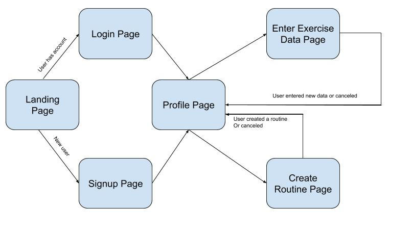

# Gainz Wireframes

---

## App Description: 
"Log" to track lifts number, for example reps, sets, and maxes. I constantly find myself asking my spotter what dumbbells I
used the previous week for an exercise and if I don't remember my own weights I used, how am I supposed to expect them to remember?
With this app, you will be able to jot down the data with ease with no need for actual pen and paper. Users will also be able 
to set goals and see their progress. Potentially, the app will display a chart of their progress as well. 

---

## Wireframe Links

1. [Landing Page](https://barrerar.github.io/gainz-wireframe/wireframes/landing-page.html)
2. [Login Page](https://barrerar.github.io/gainz-wireframe/wireframes/login-page.html)
3. [Signup Page](https://barrerar.github.io/gainz-wireframe/wireframes/signup-page.html)
4. [Profile Page](https://barrerar.github.io/gainz-wireframe/wireframes/profile-page.html)
5. [Create Routine Page](https://barrerar.github.io/gainz-wireframe/wireframes/create-routine-page.html)
6. [Exercise Entry Page](https://barrerar.github.io/gainz-wireframe/wireframes/exercise-entry-page.html)